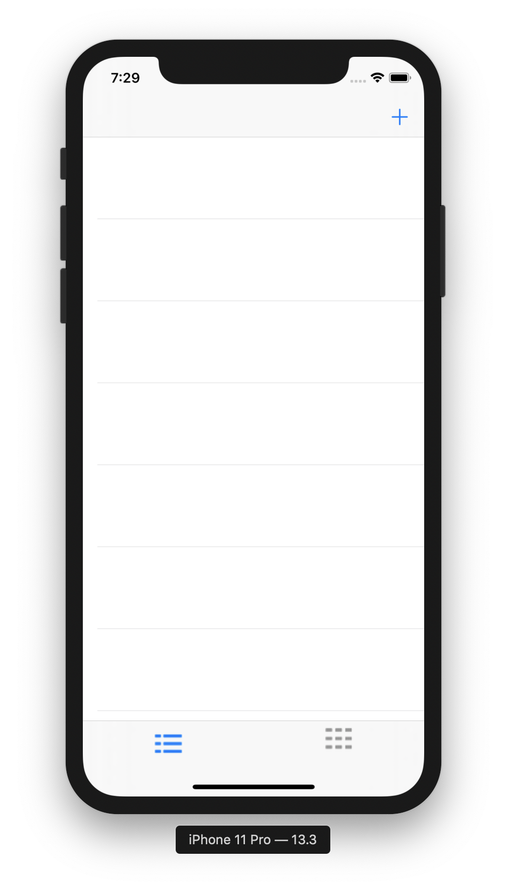
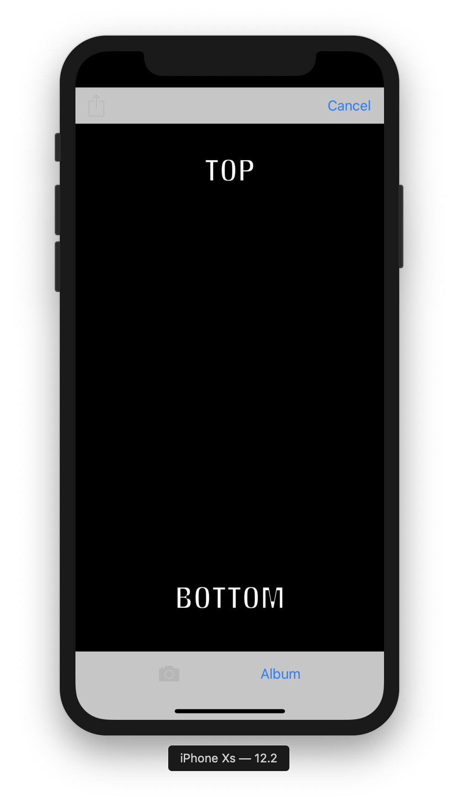
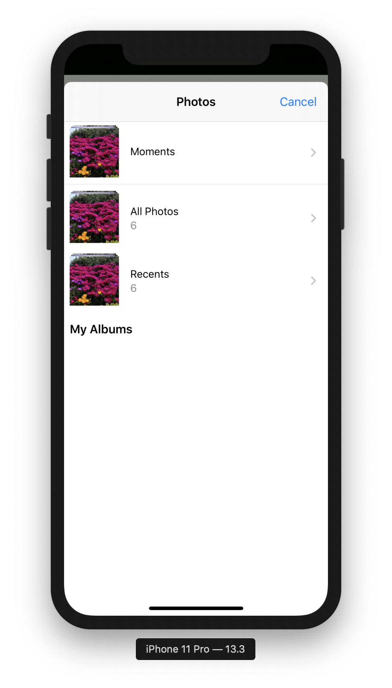
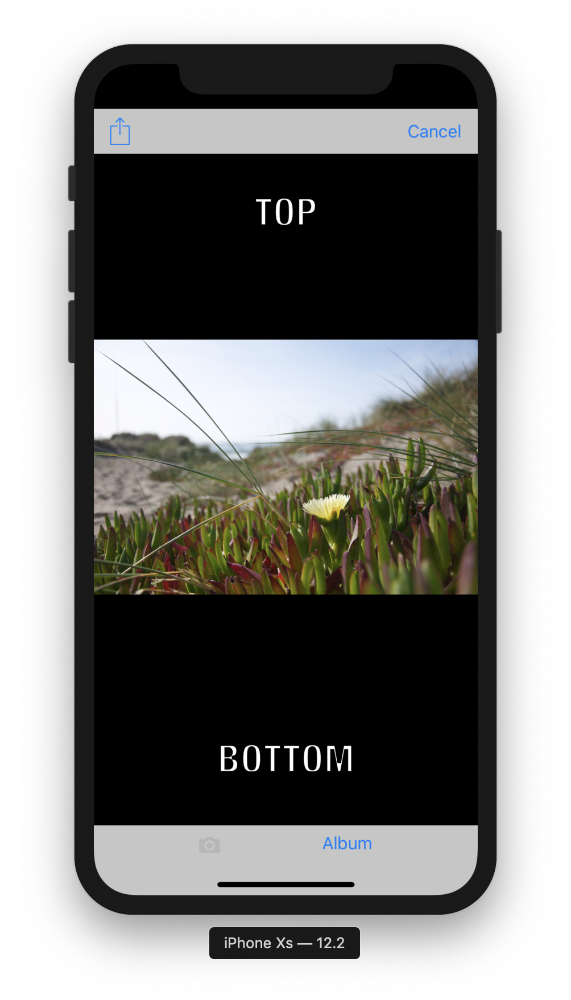
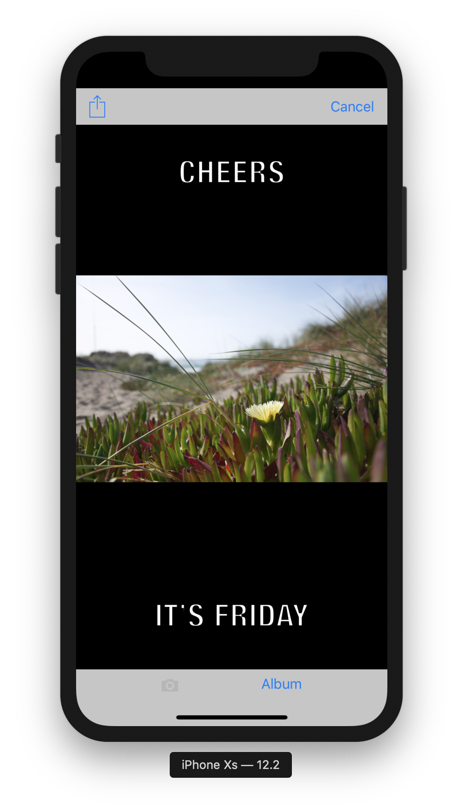
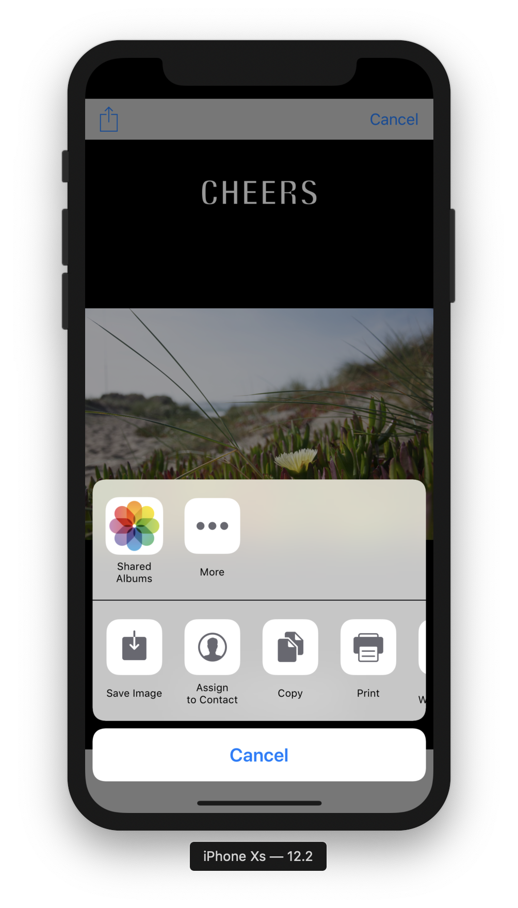
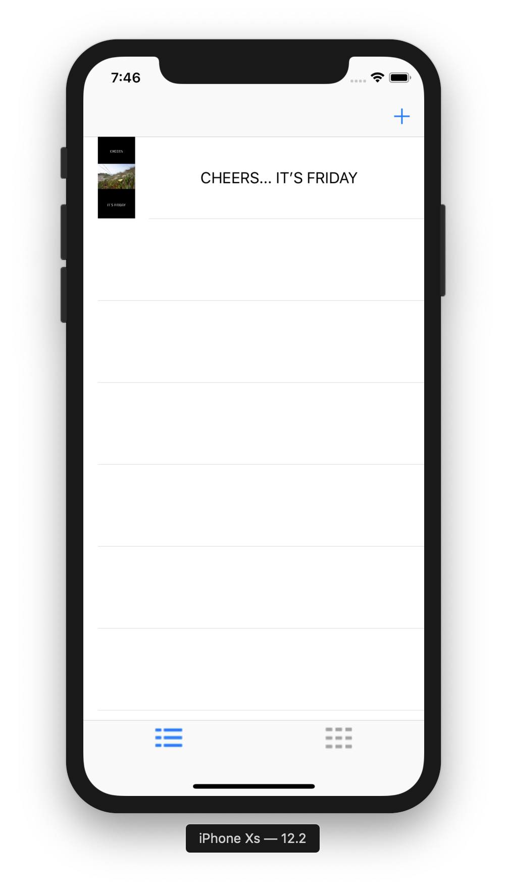
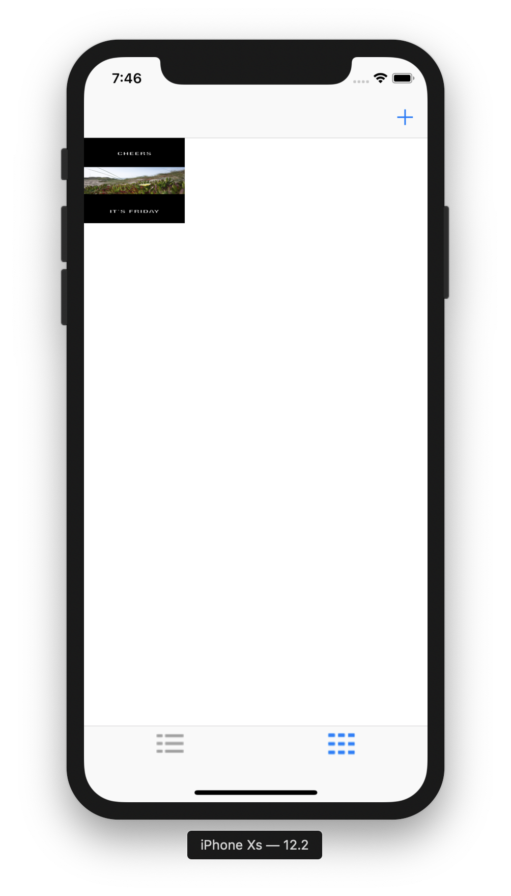

# MemeApp, iOS Developer: Elias Hall.

**Run Instructions:**
Xcode 10.3, Swift 4.2, iPhone XS

**Overview:**
This is a meme creating/saving/sharing app built with UIKit. It stores saved or shared memes in table view and collection view, both interchangable by tab. 

**Walkthrough:**
User is presented with an empty table and empty collection view, in interchangeable tab format. User taps on top right plus/add button to bring up Meme Editor. User then select the "album" button to select their meme's photo. When photo has been selected the share icon/button becomes active. User then taps on a text field to change it to its desired text. User taps on share icon/button to save and/or share photo, using the activity controller. User then hits cancel to return to table view. Note: User can select cancel at any time. If photo is saved or shared, the table view and collection view are automatically updated with the memed photo.

**info.plist:**
Added Privacy- Photo Library Additions Usage Descriptions, Privacy- Photo Library Usage Description, Privacy- Camera Usage Description so app can work on physical device

**Tools used:** **Xcode 10.3, Swift 4.2, UIKit, iPhone XS simulator** 

